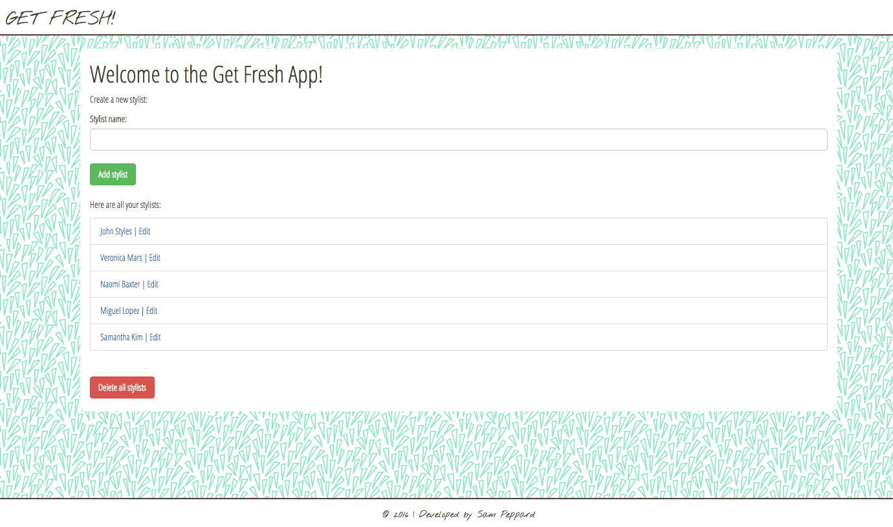

# **GET FRESH**

##### A project built using Silex, Twig and MySQL. 9.18.2016
#
##### By [Sam Peppard](https://github.com/sampeppard)
#

----
### **Description**

An app that allows a hair salon owner to add stylists and for each stylist add a list of clients.

----
### **Specifications**
| _Behavior_ | _Input_ | _Output_ |
|:---------------------------------------------------------------------:|:---------------------------------------------------------------------------:|:-------------------------------------------------------------------------------------------------------------------:|
| Return the listed stylist when a stylist name is entered | Matthew | 1. Matthew |
| Return the listed clients when the client's name and assigned stylist is entered. | Matthew | 1. Bobby, stylist - Matthew |
| Delete the stylists when the delete stylists button is pressed | delete | All stylists deleted |
| Delete the stylists when the delete stylists button is pressed | delete | All clients deleted |
----

### **Setup/Installation Requirements**

If editing or running locally:

* Clone this repository
* If editing, open project directory in Code Editor of choice
* If viewing, open your command prompt, type composer install, enter php -S localhost:8000 and type localhost:8000 in your browser address bar to view the application
* Open your browser of choice and go to localhost:8000/phpmyadmin
* Once in PHPmyAdmin, go to import tab and choose the database file db_backup.sql.zip and click Go

##Or you can set up the database with SQL commands

* SQL COMMANDS USED

1. CREATE DATABASE hair_salon;

2. USE hair_salon;

3. CREATE TABLE stylists (name VARCHAR (255), id serial PRIMARY KEY);

4. CREATE TABLE clients (name VARCHAR (255), stylist_id INT, id serial PRIMARY KEY);

----

### **Known Bugs**

No known bugs.

----
### **Support and contact details**

For comments or questions, please email sampeppard@gmail.com

----
### **Technologies Used**

HTML
CSS
PHP
PHPUnit
MySQL
Silex
Twig
Bootstrap version 3.3.7.

----
### **License**

*This application is licensed under the MIT license*

Copyright (c) 2016 **Samuel Peppard**
